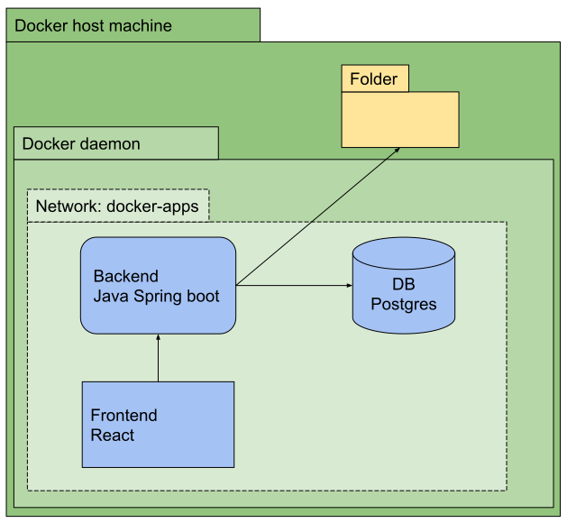

# Docker structure

## Starting and stopping the project
To run this project, use `docker compose up -d --build`, this will start the containers in `detached` mode, and will also force the subprojects' Dockerfiles to be built. To stop the project, use `docker-compose down`.

## Project structure overview
This sample project consists of three different docker containers / services; a frontend, a backend, and database. In addition these three services, the backend accesses a folder on the docker host machine. The project structure looks something like this:

